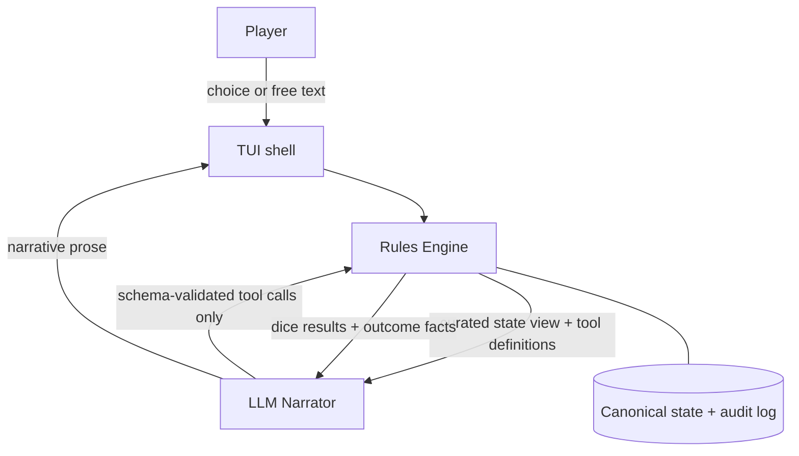
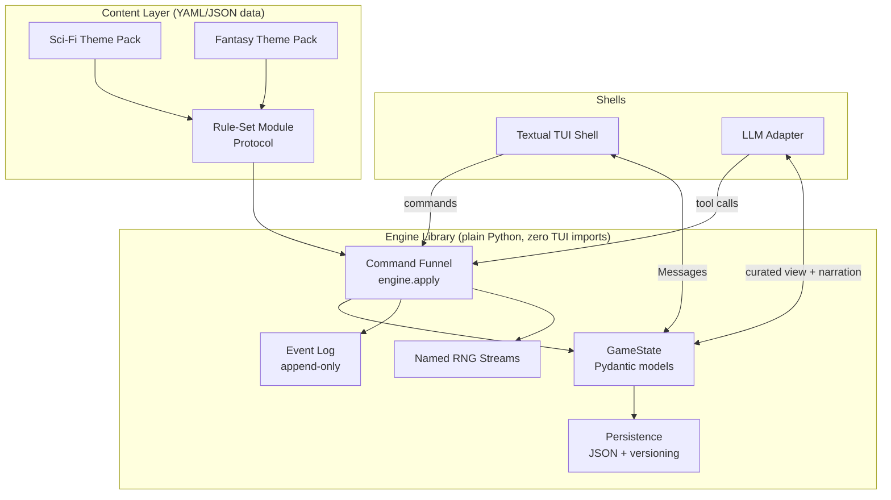
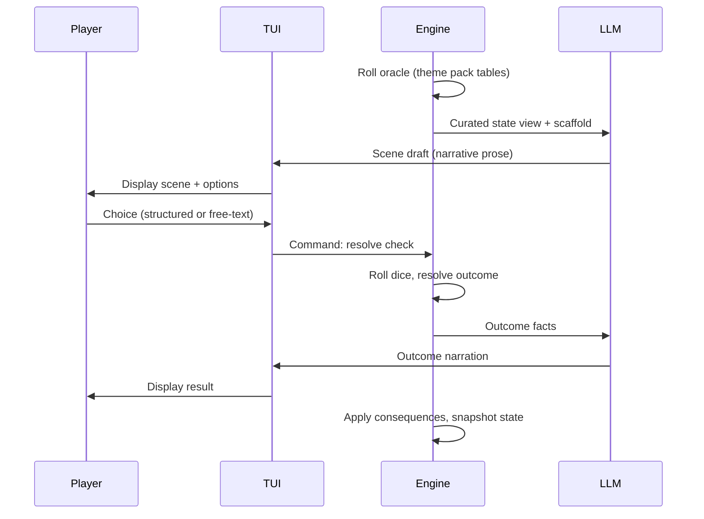

# Cepheus Adventure - Plan

## Goal Capsule

- **Objective:** Build a single-player Choose Your Own Adventure game where a deterministic rules engine owns dice, state, and outcomes and an LLM only narrates. First playable slice: lifepath character creation as a rich-terminal mini-game, growing into a full adventure loop with two theme packs.
- **Product authority:** The Product Contract below. It answers what to build, for whom, and what success means; the Planning Contract answers how.
- **Open blockers:** None. All planning questions resolved; remaining unknowns are deferred to implementation.

---

## Product Contract

### Summary

A single-player CYOA delivered as a rich terminal app, where a deterministic, pluggable rules engine is the product core and an LLM provides narration only. The engine uses a command funnel + append-only event log for all mutations; content packs are YAML/JSON validated at load time; the TUI is a thin Textual shell over the engine library; the LLM integrates via a single Pydantic AI agent with tool-call-only state mutations. v1 ships one 2D6 rule-set core (CE SRD-derived, OGL) with two theme packs — sci-fi lifepath from the SRD and an original fantasy pack — plus per-campaign configuration of death rules and resolution profile, in three playable phases: lifepath mini-game, lifepath narration, then the full adventure loop.

### Problem Frame

Existing AI RPG platforms freestyle their mechanics. AI Dungeon improvises rolls and drifts on long campaigns; AI Realm misapplies modifiers and admits anything not in your notes is eventually forgotten; Friends & Fables has produced NPCs simultaneously dead and alive. The failure is architectural: when the LLM owns both narrative and mechanics, neither is trustworthy.

Solo tabletop play solves trust with dice and tables, but the player pays in bookkeeping: table lookups, modifier arithmetic, and record-keeping interrupt the narrative flow that makes the genre fun.

The builder's motivation compounds both: the desired product is the architecture itself — a clean separation where deterministic code holds mechanical judgment and the LLM holds only semantic judgment. The game is the proof that the separation works.

### Key Decisions

- **Deterministic engine underneath, LLM narrates only.** Dice, state, and calculations execute in code; the LLM receives outcomes as facts and produces prose. This matches the 2024–2026 research consensus (LLM handles semantic judgment, code handles mechanical judgment) and the empirically validated anti-drift patterns: pre-rolled dice injected as facts, tool-call-only mutations, curated state views. (session-settled: user-directed — chosen over LLM-freestyle GMing: documented dice/state drift on AI Dungeon, AI Realm, Friends & Fables)
- **Pluggable rule-set boundary; one rule-set implemented.** Rule-sets sit behind a module interface from day one, but v1 implements only a Cepheus-flavored set based on the CE SRD. A second rule-set is the boundary's graduation test, not a v1 deliverable. (session-settled: user-directed — chosen over hybrid Cepheus+PbtA from day one: two full systems before anything is playable is how side projects stall)
- **Lifepath-first delivery.** Character creation is v0.1: a complete, deterministic mini-game playable with no LLM at all. v0.2 adds LLM narration of the lifepath; v0.3 adds the adventure loop. Each phase is independently playable. (session-settled: user-directed — chosen over engine-boundary-first or full-game-first slices: lifepath is the most engine-dense, LLM-optional subsystem)
- **Resolution as configuration.** Two resolution profiles behind one interface, selected per campaign: **Classic** (binary 2D6+DM≥8 with Effect margins, CE SRD-faithful) and **Narrative** (three-tier strong hit / weak hit with complication / miss with consequence, Starforged-style). Converts the Cepheus-vs-PbtA research disagreement into a play-testable question and exercises the module seam at its smallest point. Narrative is the default profile for new campaigns. (session-settled: user-approved — accepted over Cepheus-purist and three-tier-native: settles the debate by playing both)
- **Death rules configurable per campaign in three modes.** Ironman (permadeath, including during chargen), Checkpoint (chargen uses mishaps; loop death rewinds to scene start), Narrative (chargen mishaps; loop defeat becomes a lasting complication). Showcases the campaign-config layer. (session-settled: user-directed — chosen over any single fixed mode: all three behaviors wanted, config flag is cheap)
- **Rich TUI interface (Textual).** The engine is an importable library; the TUI is one shell over it. API and web frontends become later shells. (session-settled: user-directed — chosen over CLI-first, API-first, and minimal-web: playable and fun from week one without frontend drag)
- **Hybrid choice model.** Scenes present 2–4 structured options, each pre-mapped to an engine-known check, plus one free-text slot the LLM classifies into a check. Structure prevents paralysis and drift; the slot preserves agency. (session-settled: user-approved — accepted over structured-only and free-text-primary: Choice-of-Games norm plus AI Dungeon's documented failure modes)
- **One LLM provider, thin adapter.** v1 integrates a single provider well (structured output, validation, retry) behind a thin adapter; multi-provider support lands when a second provider is actually added. Narrows the original model-agnostic-from-day-one intent. (session-settled: user-approved — accepted over litellm-everything: provider sprawl is speculative complexity until a second provider exists)
- **Layered content model.** Scene scaffolding comes from engine-rolled oracle tables (theme-pack data); the LLM improvises texture within the scaffold; authored scenario modules plug into the same content interface later. (session-settled: user-approved — accepted over pure oracle, pure LLM improvisation, and authored-first: most engine-forward and replayable)
- **Mission/patron episodic campaigns.** The engine generates mission hooks the player may take or refuse; each mission is a self-contained arc with an ending; the campaign is the emergent career between missions. (session-settled: user-approved — accepted over vow-driven, open sandbox, and single-arc: Traveller-authentic and suits episodic CYOA sessions)
- **LLM invents, engine ratifies.** The LLM may introduce NPCs, places, and items as narrative facts registered in state; they stay mechanically inert until the engine ratifies them from rule-set templates. (session-settled: user-approved — accepted over narrate-only-what-exists and free-invention: a living world without mechanical cheating)
- **Theme packs from day one; fantasy is a priority theme.** Content — careers, skills, oracle tables, mission hooks, setting flavor — is data behind the content interface, never hard-coded in the engine. (session-settled: user-directed — chosen over a frontier-sci-fi-only v1: fantasy is a personal-priority genre and the pack architecture makes genre support cheap)
- **Python implementation stack.** Pydantic-ecosystem data models and structured output; agent-framework adoption (e.g. LangGraph) only when genuine multi-agent branching emerges. Research confirmed the stack current as of mid-2026 and flagged LiteLLM for hard version pinning (March 2026 supply-chain compromise) if used at all. Library-level picks belong to planning.

### Actors

- A1. **Player** — solo; the developer first, self-hosting others later.
- A2. **LLM Narrator** — narrates scenes and backstory, flavors structured-option text, classifies free-text input into engine-known checks. The engine derives structured options from oracle scaffold + theme-pack option templates; the LLM never authors option mechanics. Holds no direct power over state, dice, or outcomes.
- A3. **Rules Engine** — deterministic referee: rolls dice, owns canonical state, enforces the active rule-set and campaign configuration.

### Requirements

**Engine core**

- R1. All dice rolls, outcome determination, and arithmetic execute in engine code; the LLM receives results as facts and cannot influence them.
- R2. Canonical state (character, campaign, world, log) lives in engine-owned serializable data; the LLM reads a curated view per turn, never the full history. The curated view always includes: current character sheet, active mission and progress, NPCs in the current scene with dispositions, the last 3 narrative log entries (one entry = one complete scene's narration, including the player's choice and resolved outcome), and open threads. It never includes raw dice audit logs, stats of off-scene NPCs, or unoffered mission hooks.
- R3. The LLM changes state only through schema-validated tool calls; invalid outputs are rejected and regenerated.
- R4. Every roll is recorded in an audit log with its inputs and outcome, so fairness is inspectable after the fact. The audit log is append-only and excluded from Checkpoint rewind; AE3's byte-identical restoration applies to character, campaign, world, and narrative log, not the audit log.

**Rule-set and campaign configuration**

- R5. Game rules (resolution mechanic, difficulty ladders, death modes) live behind a rule-set module interface, so a second rule-set plugs in without touching the engine core. Lifepath tables, skills, and careers are theme-pack content (R20).
- R6. v1 ships one 2D6 rule-set derived from the CE SRD: six characteristics (2D6 each), career-driven lifepath, 2D6+DM checks.
- R7. Two resolution profiles, selected at campaign creation and honored by the adventure loop (lifepath uses its own binary CE SRD mechanics):
  - **Classic** — binary 2D6+DM≥8 with Effect margins, CE SRD-faithful.
  - **Narrative** — strong hit; weak hit with an engine-defined complication; miss with an engine-defined consequence. Complications and consequences are sourced from oracle tables in the active theme pack.
- R8. Three death modes, selected at campaign creation and governing both lifepath and adventure loop:
  - **Ironman** — failed survival in chargen can kill; loop death is permanent.
  - **Checkpoint** — chargen substitutes mishaps for death; loop death rewinds to the start of the current scene. Requires scene-state snapshot and restore infrastructure.
  - **Narrative** — chargen substitutes mishaps for death; loop defeat applies a lasting consequence such as injury, capture, or debt. (Named "Narrative death mode" in code/config to distinguish from the Narrative resolution profile; player-facing label may be "Scars" or "Enduring".)

**Lifepath (v0.1)**

- R9. Lifepath chargen is playable end-to-end with no LLM configured: roll characteristics, choose and qualify for a career, run 4-year terms (survival, advancement, skills, aging), muster out with benefits.
- R10. Chargen outcomes honor the campaign's death mode: Ironman permits death on failed survival; other modes apply the mishap outcome instead.

**Lifepath narration (v0.2)**

- R11. With an LLM configured, the engine feeds each term's events as facts and the LLM weaves them into backstory prose; narration never alters mechanical outcomes.

**Adventure loop (v0.3)**

- R12. The loop presents scenes offering 2–4 structured options plus one free-text slot.
- R13. Each structured option maps to an engine-known check (skill, difficulty or move, risk) before display; selecting it triggers engine resolution followed by LLM narration of the outcome. If option-mapping validation fails after retry exhaustion, the engine generates 2–4 generic options deterministically from the oracle scaffold and flags the degradation in the audit log.
- R14. Free-text input is classified by the LLM into an engine-known check; the interpreted check is shown to the player before resolution. The player may accept it, reject it to rephrase, or fall back to a structured option.
- R15. Consequences persist in canonical state — injuries, NPC dispositions, resources, open threads — and later scenes reflect them.

**Interface and persistence**

- R16. A rich TUI presents a character-sheet panel, a scrolling narrative log, and a choice menu; the engine remains an importable library independent of the TUI shell.
- R17. Campaigns save and load: quitting mid-scene and relaunching restores canonical state exactly.

**LLM integration**

- R18. One provider integration behind a thin adapter with structured output, schema validation, and retry; adding a second provider touches only the adapter.
- R19. Context for the LLM is assembled as a curated state view plus rolling chapter summaries; the full event history is never appended to prompts. A chapter is one completed mission arc; the summary is LLM-generated at mission end from logged events and validated against canonical state — no entity or mechanical claim in the summary may contradict canonical state, and on validation failure the summary is regenerated up to the retry limit before shipping the best available with a log flag.

**Content and world**

- R20. Theme packs are data: careers, skills, oracle tables, mission hooks, and setting flavor live behind a content interface; adding a pack requires no engine changes.
- R21. v1 ships two theme packs: a sci-fi pack derived from the CE SRD (24 careers, mission hooks, complication and consequence tables for the Narrative profile) and an original fantasy pack (curated career set, fantasy skills, oracles, missions, and complication and consequence tables).
- R22. Scene scaffolding comes from engine-rolled oracle tables in the active theme pack; the LLM improvises narrative texture within the scaffold.
- R23. Missions are discrete arcs with endings, generated as engine hooks (patrons, distress calls, rumors) the player may accept or refuse; the campaign is the emergent career between missions.
- R24. The LLM may introduce NPCs, places, and items as narrative facts registered in canonical state; they remain mechanically inert until any engine check targets them, at which point the engine generates stats and effects from rule-set templates.
- R25. When assembling the curated view for a scene, the engine re-surfaces narrative facts whose entities are referenced by the current scene's oracle scaffold, player input, or active threads.

### Key Flows

- F0. **App launch**
  - **Trigger:** Player opens the application.
  - **Actors:** A1
  - **Steps:** Player sees a main menu offering new campaign or continue; selecting new enters F1; selecting continue loads a saved campaign (R17) and resumes at the appropriate phase.
  - **Covered by:** R17
- F1. **Campaign creation**
  - **Trigger:** Player starts a new campaign.
  - **Actors:** A1, A3
  - **Steps:** Player selects rule-set (v1: Cepheus), theme pack (v1: sci-fi or fantasy), resolution profile (Classic or Narrative), and death mode (Ironman, Checkpoint, or Narrative). Engine instantiates the campaign configuration.
  - **Covered by:** R5, R7, R8, R20
- F2. **Lifepath mini-game**
  - **Trigger:** New campaign begins chargen.
  - **Actors:** A1, A3
  - **Steps:** Engine rolls characteristics; player picks a career and rolls qualification; on failed qualification, the engine offers a different career, a draft roll, or drifter entry per CE SRD rules; each term the engine rolls survival, advancement, skills, and aging, presenting choices where the tables allow them; loop ends at mustering out with benefits. In Ironman, a failed survival roll can end the character and offer an immediate restart.
  - **Covered by:** R9, R10
- F3. **Lifepath narration**
  - **Trigger:** An LLM is configured and a lifepath term completes.
  - **Actors:** A2, A3
  - **Steps:** Engine passes the term's mechanical events as facts; LLM returns backstory prose; engine appends prose to the campaign log without altering mechanical outcomes.
  - **Covered by:** R3, R11
- F4. **Adventure scene**
  - **Trigger:** Player enters the adventure loop with a mustered-out character.
  - **Actors:** A1, A2, A3
  - **Steps:** Engine rolls oracle scaffolding from the active theme pack; LLM drafts a scene from curated state plus the scaffold, registering any invented NPCs, places, or items as narrative facts; engine validates and attaches 2–4 mechanically mapped options plus the free-text slot; player chooses; engine resolves the check under the active profile; LLM narrates the outcome; engine applies consequences to canonical state.
  - **Covered by:** R1, R2, R12, R13, R14, R15, R22, R24
- F5. **Defeat handling**
  - **Trigger:** A character meets a death condition in the adventure loop.
  - **Actors:** A1, A2, A3
  - **Steps:** Ironman — character is permanently dead; engine offers a new lifepath. Checkpoint — state rewinds to the current scene's start, including removal of any LLM-registered narrative facts introduced during the scene. Narrative — engine marks the character defeated, applies a lasting consequence, and the LLM narrates the new situation.
  - **Covered by:** R8, R15, R17
- F6. **Mission lifecycle**
  - **Trigger:** Player is between missions in the adventure loop.
  - **Actors:** A1, A2, A3
  - **Steps:** Engine rolls the active theme pack's hook tables; LLM frames the hook as an offer scene; player accepts or refuses; on refusal, the engine generates a new hook; on accept, the mission runs as a sequence of scenes toward an ending (success, failure, or abandonment); consequences persist; the engine returns to hook generation.
  - **Covered by:** R15, R22, R23

### Acceptance Examples

- AE1. **Covers R1, R4. (v0.1)** During any check, the audit log shows the roll's inputs and outcome; the LLM's narration for that beat can be compared against the log and never differs mechanically.
- AE2. **Covers R8, R10. (v0.1)** In Ironman mode, a failed survival roll during chargen ends the character and offers an immediate new lifepath; in Checkpoint or Narrative mode the same roll produces a mishap and chargen continues.
- AE3. **Covers R8, R17. (v0.3)** In Checkpoint mode, a lethal outcome in the adventure loop restores canonical state to the current scene's start, byte-identical to the state captured when the scene began, including removal of LLM-registered facts.
- AE4. **Covers R8, R15. (v0.3)** In Narrative mode, a lethal outcome marks the character defeated, applies a lasting consequence visible on the character sheet, and play continues in a new scene reflecting that consequence.
- AE5. **Covers R12, R14. (v0.3)** Typing "I bribe the dock officer" into the free-text slot produces an interpreted check (e.g. Deception vs. the officer) shown to the player before the engine resolves it; the player can reject it to rephrase or pick a structured option.
- AE6. **Covers R7. (v0.3)** The same action under the Classic profile resolves as binary success/failure with an Effect margin; under the Narrative profile it resolves as strong hit, weak hit with a complication, or miss with a consequence.
- AE7. **Covers R9. (v0.1)** A complete lifepath — characteristics through mustering out — runs in the TUI with no LLM provider configured and no network access.
- AE8. **Covers R17. (v0.1)** Quitting mid-scene and relaunching resumes the campaign at the same scene with identical canonical state.
- AE9. **Covers R24. (v0.3)** The LLM introduces a bartender in narration; canonical state records the NPC as a narrative fact with no stats; when any engine check targets the bartender, the engine generates stats from rule-set templates at that moment and logs the generation.
- AE10. **Covers R20, R21. (v0.3)** Creating a campaign with the fantasy pack presents fantasy careers, skills, oracles, and mission hooks throughout lifepath and the adventure loop, with no engine code changes from the sci-fi pack.
- AE11. **Covers R3. (v0.2)** When the LLM returns a response attempting to alter a die result or set state outside a schema-validated tool call, the engine rejects the output, logs the rejection, and regenerates; canonical state is unchanged.
- AE12. **Covers R11. (v0.2)** Across a full lifepath with an LLM configured, the narration references each term's mechanical events correctly, maintains consistent character voice, and replaying a term yields varied prose but mechanically faithful outcomes.
- AE13. **Covers R2. (v0.2)** When the narrator is invoked, the prompt contains the character sheet, active mission, scene NPCs, last 3 log entries, and open threads (fields empty where not yet applicable); it does not contain raw dice audit logs, off-scene NPC stats, or unoffered hooks.
- AE14. **Covers R22. (v0.3)** A scene's structured options and narrative scaffold are derivable from oracle table rolls in the active theme pack; the same scene inputs produce the same scaffold deterministically.
- AE15. **Covers R23. (v0.3)** A mission hook is offered, accepted, played through multiple scenes to a recognized ending (success, failure, or abandonment), and its consequences persist into the next hook cycle; the engine returns to hook generation.
- AE16. **Covers R19. (v0.3)** After two completed missions, the LLM's context includes two chapter summaries plus current canonical state, with no raw event history from either mission.

### Success Criteria

- A 20-minute lifepath session in the TUI is complete and enjoyable with no LLM configured. (v0.1)
- With an LLM configured, the developer prefers narrated lifepath output over raw mechanical log. (v0.2)
- A 30-minute adventure-loop session completes one mission arc and the developer wants to start another. (v0.3)
- The two resolution profiles share one interface; swapping a campaign's profile requires no engine-core changes.
- The same engine core runs both v1 theme packs with no pack-specific engine code.
- At any moment, an observer can verify dice and state live outside the LLM by inspecting the audit log and canonical state.
- The developer wants to keep playing after a session ends — the fun check this project exists to pass.

### Scope Boundaries

**Deferred for later**

- Trade and speculative cargo, ship design, world/sector generation (UWP), space combat, psionics — the large CE SRD subsystems wait until the adventure loop is fun.
- A second full rule-set (e.g. a pure PbtA playbook module) — the module boundary's graduation test, post-v1.
- Additional theme packs beyond sci-fi and fantasy, and authored scenario modules — the content interface already accepts both.
- API, web, and mobile shells over the engine library.
- Multi-provider LLM support beyond the first integration.
- Embedding-based narrative fact retrieval (vector search over the fact registry, e.g. graphiti or mem0) — post-v1 upgrade if entity-based matching proves too narrow.
- Multiplayer — the architecture must not preclude it, but nothing is built for it.

**Outside this product's identity**

- Hosted SaaS, accounts, or multi-tenancy — "public later" means self-hostable, not a service.
- An engine-off freestyle mode — pure-LLM narration contradicts the product's reason to exist.

<!-- ce-section: work-relationships -->
### How This Work Fits Together

This plan owns the engine core, one Cepheus-flavored rule-set, and the TUI shell through the adventure loop. The broader breakdown below is current understanding, not a committed roadmap; later areas are contextual candidates a future brainstorm may revise, split, merge, or discard.

- Simulation subsystems (trade, ship design, world generation) — **Depends on** the engine core and rule-set interface this plan ships; each adds a module without touching the core.
- Second rule-set (e.g. pure PbtA) — **Depends on** the module boundary proving itself with the two resolution profiles; **Enables** the multi-rule-set vision from the original brief.
- API/web/mobile shells — **Depends on** the engine-as-library separation the TUI shell exercises; **Can proceed independently of** new rule content.
- Multiplayer — **Still to decide** whether it belongs to this product at all; nothing in this plan builds toward or blocks it.

### Dependencies / Assumptions

- CE SRD text under OGL 1.0a (all text Open Game Content); product must ship the OGL text and Section 15 notices. "Cepheus Engine" and "Samardan Press" are Product Identity — usable only via a compatibility statement, so the final game name is not yet settled ("Cepheus Adventure" is a working title).
- Narrative-profile mechanics draw on the Starforged Reference Guide and dataforged dataset (CC-BY-4.0); the legacy `ironsworn/` preview data in dataforged is CC BY-NC and must be avoided.
- One LLM provider account available to the developer (Anthropic default); the adapter absorbs provider differences.
- Python with the Pydantic ecosystem; if LiteLLM is used, versions are pinned hard (March 2026 supply-chain compromise, fixed in 1.83.0).
- Assumption: campaigns persist across sessions; save/load is in v1 (R17).
- Assumption: English-language narration only.

### Outstanding Questions

- What is the final game name, given the "Cepheus Engine" trademark carve-out? **Deferred to Implementation** — branding does not block building.
- Which careers make the fantasy pack's curated set (8–12), and how are skills renamed? **Deferred to Implementation** — content authoring during U9.
- How deep does equipment/gear modeling go for the adventure loop? **Resolved:** minimal viable (name + effect tags only, no weight/encumbrance tracking).
- What retry limit applies when LLM output fails schema validation? **Resolved:** 3 attempts, then display the raw mechanical outcome without prose and flag the failure in the audit log.

### Sources / Research

Research dossiers (verification of the Cepheus ecosystem, LLM-GM architectures, and solo-RPG foundations, plus independent claim verdicts) live in this repo:

- docs/research/cepheus-adventure/cepheus-ecosystem.md — variant-by-variant verification and license map; recommends CE SRD as first module.
- docs/research/cepheus-adventure/llm-gm-architectures.md — academic and market state of the art; anti-drift patterns; stack currency check.
- docs/research/cepheus-adventure/solo-rpg-foundations.md — solo design patterns; alternative systems comparison; CYOA choice-granularity precedents.
- docs/research/cepheus-adventure/claim-verdicts.md — 12 load-bearing claims independently verified; none refuted.

Implementation research (library APIs and engine patterns) gathered during planning:

- Textual 8.2.8 (June 2026): reactive data binding, `@work` workers for streaming, BINDINGS for keyboard nav, three-panel layout via CSS fr units.
- Pydantic AI v2.18.0 (July 2026): single agent with tools, `output_type=BaseModel`, `ModelRetry` for validation, `UsageLimits` for cost caps, `stream_text(delta=True)` for streaming.
- lorekit (github.com/matluz1/lorekit): structural reference for two-layer deterministic engine + agent runtime split; command funnel + event log pattern.

Key external sources:

- CE SRD mirrors: orffenspace.com/cepheus-srd, evolvedexperiment.github.io/cepheus-srd, cepheus-srd.opengamingnetwork.com
- Agentic GM research: arxiv.org/abs/2502.19519 (ChatRPG; code at github.com/KarmaKamikaze/ChatRPG)
- Reference implementations: github.com/xdy/twodsix-foundryvtt (Apache-2.0), github.com/rsek/dataforged (CC-BY-4.0)
- Starforged licensing: tomkinpress.com/blogs/news/lets-talk-about-ironsworn-licensing
- PbtA policy: apocalypse-world.com/pbta/policy (mechanics free; text permissioned)

### Architecture Boundary

The load-bearing concept — what the LLM may and may not touch:

The engine rolls, resolves, and records; the LLM proposes, classifies, and narrates. Every arrow from LLM to engine passes through schema validation; every mechanical fact (dice results, outcomes) the LLM narrates originates in the engine. Narrative facts the LLM introduces are registered in state but remain mechanically inert until the engine ratifies them.

---

## Planning Contract

Product Contract preservation: unchanged from ce-brainstorm, except R25 added (narrative fact retrieval, user-approved scope addition) and F6 simplified (free-exploration struck, user-approved).

### Key Technical Decisions

- **Command funnel + append-only event log for all mutations.** Every state change is a Command object passed through one `engine.apply(cmd)` funnel: validate → resolve (dice) → mutate → append event. The event log and audit log are one append-only structure; audit views filter events by roll type. Checkpoint rewind restores canonical state but never truncates the event log. This single mechanism provides determinism, testing, and the audit log. Checkpoint rewind is provided by scene-start snapshots in U8, made safe by the funnel's single-mutation-path guarantee. Chosen over a heavy FSM library (transitions, python-statemachine) because FSMs encode rules as state transitions — a poor fit for table-driven TTRPG mechanics where rules are data, not states — and ad-hoc mutation because scattered mutation paths make audit and rewind impossible. The funnel is the engine's trust boundary: every LLM tool call, every player action, every oracle roll passes through the same validate-resolve-mutate-append pipeline. Reference: lorekit's cruncher/ module, Game Programming Patterns Command.
- **Named seeded RNG streams stored inside state.** One `random.Random` instance per subsystem (oracle, lifepath, resolution checks) so rolls don't shift each other's sequences. RNG state persisted via `getstate()`/`setstate()` inside the save file; Pydantic field serializers convert tuples to lists on JSON dump and back on load. Never module-level `random`. Tests inject forced-result queues via a Roller protocol. New streams are added when their subsystem lands (combat, loot are post-v1).
- **Protocol classes for plugin interfaces.** Rule-set and theme-pack interfaces use Python Protocol (structural subtyping), not ABC inheritance. ABCs would force theme packs to import engine code and inherit from engine classes — the wrong direction for pure-data content packs. Protocols let packs be validated YAML/JSON that satisfy the interface by shape alone. The tradeoff: Protocols don't enforce at import time the way ABCs do; instead, load-time validation with referential integrity checks catches missing or malformed content before the engine starts. Pack discovery uses an in-repo directory-scan registry over `src/themepacks/data/` — entry points are the post-v1 graduation step when a third-party pack actually exists.
- **JSON file persistence with save versioning.** Campaign saves are single JSON documents with `save_version: int` and stepwise migration functions. Atomic writes (temp + `os.replace`). Chosen over pickle (version-fragile, unsafe to load untrusted files) and SQLite (adds an operational dependency and query overhead for a single-player game whose entire state fits in one small document). The tradeoff: JSON doesn't support incremental saves or concurrent access — acceptable because the game is single-player, single-session, and saves are small enough that full-document writes are instant.
- **Textual reactive architecture with zero Textual imports in engine.** The engine is a plain sync Python package. The TUI is a client: it calls `engine.apply(cmd)` and subscribes to engine events via Textual Messages. Reactive `watch_*` methods update panels. LLM work runs in `@work` async workers; results post Messages back, never touching widgets from threads.
- **Pydantic AI single agent with tool definitions.** One agent with `output_type=BaseModel` for structured narration and tools for state mutation. `ModelRetry` for validation-rejection. `UsageLimits` on every turn for cost caps. Narration prose streams via `stream_output()` on a structured model (rendering the prose field as partials arrive); plain-text paths use `stream_text(delta=True)`. Single agent until genuine multi-agent branching emerges.
- **PbtA-compatible tier boundaries for Narrative profile.** On 2D6+DM: 10+ strong hit, 7–9 weak hit with complication, ≤6 miss with consequence. Difficulty DMs shift the roll, not the bands. The effective DM is clamped to -3..+3 for tier resolution so the partial-success band doesn't collapse at DM extremes (strong characters still see complications, weak characters still see successes).
- **Scene = one F4 cycle for Checkpoint scope.** A scene is a single player decision point: oracle roll → LLM draft → options → choice → resolution → narration. Checkpoint snapshots at scene boundaries using in-memory deep copies (`model_copy(deep=True)`) in a depth-1 slot, replaced at each F4 cycle start. The scene-start snapshot is persisted alongside the campaign save so rewind works after relaunch.
- **Template narration in v0.1.** The lifepath mini-game includes engine-generated prose templates for term outcomes (not LLM), providing narrative texture without requiring an LLM. This answers the standalone-fun question and provides the fallback narration when no LLM is configured.
- **v0.3 sub-phased into v0.3a and v0.3b.** v0.3a: adventure loop with structured choices plus mission lifecycle (no free-text, no LLM invention). v0.3b: free-text classification + LLM invention + fact retrieval. Two playable checkpoints instead of one monolithic release.
- **Entity-based narrative fact retrieval in v0.3.** When assembling the curated view, the engine re-surfaces narrative facts whose entity names are referenced by the current scene's oracle scaffold, player input, or active threads. Deterministic, testable, no ML infrastructure. Embedding-based retrieval (graphiti/mem0) is the post-v1 upgrade path if entity matching proves too narrow.
- **Content packs as YAML/JSON with load-time validation.** Theme-pack content (careers, skills, oracle tables, lifepath tables, complication tables) is data, not code. Validated at load time with referential integrity checks (every skill's career exists, table ranges contiguous). Engine code references content only by ID.

### High-Level Technical Design

**Component topology:**

**Scene flow (F4 cycle — one Checkpoint snapshot unit):**

### Assumptions

- LLM provider defaults to Anthropic (Claude). The adapter makes switching cheap; no user preference was stated.
- Fantasy pack lands in v0.3, not v0.1. The sci-fi pack validates the content interface first; fantasy is original authoring, not SRD transcription.
- Fantasy pack careers: 8–12 curated careers (Knight, Ranger, Priest, Mage, Thief, Sailor, Scholar, Farmer, Bard, Mercenary, Healer, Hunter). Exact set is content authoring during U9.
- Equipment modeling is minimal viable: name + effect tags only (e.g., "Laser Pistol: 3D6 damage, range 10m"). No weight or encumbrance tracking.
- Classic resolution profile is available for the fantasy pack but untested for that genre; Narrative is the recommended default for fantasy campaigns.
- Auto-save on every scene transition and term completion. No manual save; always-on. Saves are per-campaign JSON files.
- Terminal minimum is 80x24; character sheet panel becomes toggleable below 100 columns.
- Free-exploration mode struck from F6. Refusal always loops to a new hook. Post-v1 candidate.
- Structured options display fiction label plus compact mechanics suffix (skill + difficulty or tier band), consistent with the product's transparency identity.
- Dice rolls render as inline mechanics lines in the narrative log per resolution (roll, DM, total, tier), making the trust differentiator visible at the moment doubt arises.
- Free-text confirmation is an explicit choice-menu state: interpreted check rendered as a labeled pending option, with bindings for confirm (Enter), rephrase (returns focus to Input with text preserved), and escape-to-structured (re-highlights OptionList).
- LLM calls show a generating indicator with retry counter (surfaced after attempt 1); auto-scroll follows the stream only when the log is already at bottom; input is inert during in-flight workers.
- Defeat transitions show an interstitial per mode: Ironman shows death summary and restart choice; Checkpoint shows a rewind notice marking removed narration (divider line "rewound to scene start") before restoring; Narrative shows the consequence applied and where it appears on the sheet.
- Summary validation is scoped to mechanically checkable invariants: every named entity exists in canonical state; summary contains no dice or mechanical claims (enforced by generating from a structured template of mission outcomes). No LLM-judge step in v1.
- Narrative fact retrieval always includes a capped recency-ranked slice of the fact registry (last N facts plus facts on active threads) in the curated view, so the LLM can reference existing entities by name; exact-match retrieval is an additional channel.
- Event sourcing was evaluated as an alternative storage model for the command funnel. Rejected for v1: the deep-copy snapshot + append-only log design is simpler to implement and the event-log divergence after rewind is handled by the RewindApplied marker. Event sourcing remains a post-v1 candidate if snapshot management becomes complex.

### Risks & Dependencies

- **Anthropic API** — LLM narration depends on the Anthropic API. Rate limits, cost per turn, and availability affect v0.2+ gameplay. Mitigation: `UsageLimits` on every turn; template narration fallback when the provider is unreachable; the adapter makes switching providers cheap.
- **Pydantic AI v2** — released June 2026 (v2.18.0 as of July 2026). API may evolve across minor versions. Mitigation: pin the dependency version; the adapter wraps all Pydantic AI calls behind a project-owned interface.
- **Textual** — v8.2.8 is current. The API has been stable since v1 but the library moves fast. Mitigation: pin the dependency version; the TUI is a thin shell, so API changes are localized to the `src/tui/` package.
- **CE SRD content transcription** — 24 careers, skill tables, and oracle tables must be transcribed from the SRD text into YAML/JSON. This is mechanical but time-consuming. Mitigation: transcribe incrementally (start with 6–8 careers for v0.1 validation, add the rest before v0.1 ships).
- **Fantasy pack content authoring** — original game design (careers, skills, oracles) with no source SRD. Scope risk if authoring expands. Mitigation: curated set of 8–12 careers; reuse CE SRD skill names where possible; the content interface already proven by the sci-fi pack.

---

## Implementation Units

| U-ID | Title | Files | Depends on |
|------|-------|-------|------------|
| U1 | Engine core + persistence | src/engine/ | — |
| U2 | Interfaces + sci-fi pack | src/rulesets/, src/themepacks/ | U1 |
| U3 | Lifepath engine | src/engine/lifepath.py | U1, U2 |
| U4 | TUI shell | src/tui/ | U1, U3 |
| U5 | LLM adapter + narration | src/llm/ | U1, U3 |
| U6 | Narrative resolution profile | src/rulesets/profiles.py | U2 |
| U7 | Scene engine + retrieval | src/engine/scene.py, src/engine/mission.py | U2, U5, U6 |
| U8 | Death modes + Checkpoint | src/engine/death.py, src/engine/checkpoint.py | U1, U7 |
| U9 | Fantasy theme pack | src/themepacks/data/fantasy/ | U2, U7 |

### Phase A — v0.1 Lifepath Mini-Game

#### U1. Engine core + persistence foundation

- **Goal:** Deterministic command funnel, append-only event log, seeded RNG streams, Pydantic state models, JSON save/load with versioning.
- **Requirements:** R1, R2, R4, R17
- **Dependencies:** None (foundation)
- **Files:** `src/engine/__init__.py`, `src/engine/commands.py`, `src/engine/state.py`, `src/engine/dice.py`, `src/engine/audit.py`, `src/engine/persistence.py`, `tests/engine/test_commands.py`, `tests/engine/test_state.py`, `tests/engine/test_dice.py`, `tests/engine/test_persistence.py`
- **Approach:** Command funnel (`engine.apply(cmd)`) as the sole mutation path. Commands are validated, resolved (dice), mutated, and appended to the event log. GameState is a Pydantic root model with discriminated unions for polymorphic entities. Named RNG streams (oracle, lifepath, combat) stored inside state with `getstate()`/`setstate()`; Pydantic field serializers convert tuples to lists on JSON dump and back on load (`setstate()` requires tuples). Save files are single JSON documents with `save_version` and atomic writes.
- **Execution note:** Start with a failing test for command funnel determinism (same seed + same commands → same state hash).
- **Patterns to follow:** lorekit cruncher/ module layout (github.com/matluz1/lorekit); Game Programming Patterns Command pattern.
- **Test scenarios:**
  - Covers AE1. Every dice roll is recorded in the audit log with its inputs (dice, modifiers, stream) and outcome; log entries are inspectable after the fact
  - Dice determinism: `random.Random(42)` produces identical roll sequences across two instances
  - Command funnel validation: invalid command raises validation error before touching state
  - Event log append-only: entries cannot be removed or modified after append
  - State serialization round-trip: `GameState` → JSON → `GameState` produces identical hash
  - Save/load restore: save mid-command-sequence, load, continue — identical outcomes
  - RNG state persistence: save/load preserves RNG position (next roll after load matches uninterrupted sequence)
  - Atomic write: interrupted save leaves previous save intact
- **Verification:** All engine tests pass with `pytest tests/engine/`. State serialization round-trip produces identical hash. Save/load produces identical subsequent outcomes.

#### U2. Rule-set + theme-pack interfaces + CE SRD sci-fi pack

- **Goal:** Protocol-based plugin interfaces and CE SRD content as validated YAML/JSON data.
- **Requirements:** R5, R6, R20, R21 (sci-fi portion); F1 (campaign creation uses these interfaces)
- **Dependencies:** U1
- **Files:** `src/rulesets/__init__.py`, `src/rulesets/base.py`, `src/rulesets/cepheus.py`, `src/themepacks/__init__.py`, `src/themepacks/base.py`, `src/themepacks/cepheus_scifi.py`, `src/themepacks/data/scifi/careers.yaml`, `src/themepacks/data/scifi/skills.yaml`, `src/themepacks/data/scifi/oracles.yaml`, `src/themepacks/data/scifi/complications.yaml`, `src/themepacks/data/scifi/missions.yaml`, `tests/rulesets/test_base.py`, `tests/themepacks/test_scifi.py`
- **Approach:** Protocol classes for RuleSet (resolution mechanic, difficulty ladder, death modes) and ThemePack (careers, skills, oracle tables, lifepath tables, complication tables). Content validated at load with referential integrity (every skill's career exists, table ranges contiguous). CE SRD content transcribed to YAML/JSON data files. Pack discovery via `importlib.metadata` entry points.
- **Patterns to follow:** Protocol > ABC (structural subtyping); stevedore-style plugin discovery via `importlib.metadata`.
- **Test scenarios:**
  - Protocol conformance: CE SRD rule-set satisfies RuleSet protocol
  - Sci-fi pack data validity: all careers have required fields (survival target, advancement target, skill tables)
  - Referential integrity: every skill references an existing career; every oracle table range is contiguous
  - Pack discovery: theme packs are discoverable via entry points
  - Career table completeness: 6–8 starter careers present with correct table structures (full 24-career set is a pre-v1 content milestone, not a v0.1 gate)
  - Difficulty ladder: Routine +2 through Formidable -6 modifiers match CE SRD
- **Verification:** Protocol conformance tests pass. Sci-fi pack loads without validation errors. All 24 careers present with complete tables.

#### U3. Lifepath engine

- **Goal:** Full lifepath chargen playable end-to-end with no LLM, including template narration.
- **Requirements:** R9, R10, AE2, AE7; F2 (lifepath mini-game)
- **Dependencies:** U1, U2
- **Files:** `src/engine/lifepath.py`, `src/engine/narration.py`, `tests/engine/test_lifepath.py`, `tests/engine/test_narration.py`
- **Approach:** Term loop driven by theme-pack career tables. Each term: survival roll (death/mishap by mode), advancement roll, skill table roll, aging check (34+). Qualification failure routes to draft or drifter per CE SRD. Mustering out computes benefits. Template narration generates one-line prose per term outcome from templates ("You barely survive a mining accident on an airless rock").
- **Test scenarios:**
  - Complete lifepath run: characteristics → career → terms → mustering out, all rolls logged
  - Covers AE2. Ironman death-in-chargen: failed survival ends character, offers immediate restart
  - Covers AE2. Non-Ironman mishap: failed survival produces mishap, chargen continues
  - Covers AE7. Complete lifepath with no LLM configured: all steps deterministic, no network access
  - Qualification failure: player is offered draft roll, drifter entry, or different career
  - Aging effects: characteristics reduced per CE SRD aging table at 34+
  - Mustering out: benefits computed from career and rank
  - Template narration: each term produces one-line prose referencing the mechanical outcome
- **Verification:** Complete lifepath runs end-to-end with no LLM. All AE2 and AE7 scenarios pass. Template narration produces coherent prose per term.

#### U4. TUI shell

- **Goal:** Rich terminal interface with three-panel layout, campaign management, lifepath interaction.
- **Requirements:** R16, AE8; F0 (app launch), F1 (campaign creation)
- **Dependencies:** U1, U3
- **Files:** `src/tui/__init__.py`, `src/tui/app.py`, `src/tui/screens/main_menu.py`, `src/tui/screens/campaign_config.py`, `src/tui/screens/lifepath.py`, `src/tui/widgets/character_sheet.py`, `src/tui/widgets/narrative_log.py`, `src/tui/widgets/choice_menu.py`, `tests/tui/test_app.py`
- **Approach:** Textual App with Screen-based navigation. Three-panel layout: character sheet sidebar (Static), narrative log main (RichLog), choice menu bottom (OptionList + Input). Reactive `watch_*` methods update panels when engine state changes. BINDINGS: Tab/Shift-Tab panel focus, number keys scoped to OptionList (choice selection active only when the list has focus), Enter to submit free-text. Text labels alongside any color coding for outcome tiers; PageUp/PageDown and Home/End bindings for the RichLog. Campaign config offers only implemented options per phase (v0.1: sci-fi pack, Classic profile); unimplemented options are hidden or shown disabled. Auto-save after every applied command. Main menu includes a save picker listing per-campaign saves with name, theme pack, and last-played timestamp; disabled 'continue' state when none exist; name prompt at campaign creation. Status surface for degraded modes: 'narration unavailable — showing mechanical outcomes' on retry exhaustion, 'connection lost — template narration' on provider failure.
- **Execution note:** Mostly packaging/config — prefer Textual's `run_test()` pilot for smoke verification over unit coverage.
- **Test scenarios:**
  - Covers AE8. Save and resume: quit mid-lifepath, relaunch, resume at same term with identical state
  - Three-panel layout renders character sheet, narrative log, and choice menu
  - Keyboard navigation: Tab moves focus between panels, number keys select choices
  - Lifepath interaction: term outcomes appear in narrative log, choices presented as OptionList items
  - Campaign creation flow: F0 main menu → F1 config → F2 lifepath, each screen transition works
  - Responsive layout: panels usable at 80x24, character sheet collapses below 100 columns
- **Verification:** TUI launches, lifepath is playable end-to-end. AE8 save/resume passes. Keyboard navigation works between all panels.

### Phase B — v0.2 Lifepath Narration

#### U5. LLM adapter + lifepath narration

- **Goal:** Pydantic AI agent with tool definitions, structured output, curated state view, lifepath backstory generation.
- **Requirements:** R3, R11, R18, R19, AE11, AE12, AE13; F3 (lifepath narration)
- **Dependencies:** U1, U3
- **Files:** `src/llm/__init__.py`, `src/llm/adapter.py`, `src/llm/tools.py`, `src/llm/state_view.py`, `src/llm/prompts.py`, `tests/llm/test_adapter.py`, `tests/llm/test_state_view.py`, `tests/llm/test_tools.py`
- **Approach:** Pydantic AI Agent with `output_type=BaseModel` for structured narration and tools for state mutation. Tools mutate state via the command funnel (never directly). `ModelRetry` for validation-rejection. `UsageLimits` on every turn. Curated state view assembled per R2 (character sheet, active mission, scene NPCs, last 3 log entries, open threads; never raw dice logs, off-scene stats, unoffered hooks). Template narration fallback when no LLM configured.
- **Test scenarios:**
  - Covers AE11. Invalid LLM output (attempting to alter dice or state outside tools) is rejected, logged, and regenerated; canonical state unchanged
  - Covers AE12. Full lifepath with LLM configured: narration references each term's mechanical events correctly, maintains consistent voice
  - Covers AE13. Curated view contains required fields and excludes prohibited ones (no raw dice logs, no off-scene NPC stats)
  - Tool-call validation: tools reject invalid arguments with clear errors
  - Retry limit: 3 attempts on invalid output, then raw mechanical outcome displayed with audit log flag
  - Template fallback: narration works without LLM using template prose
  - Usage limits: cost caps enforced on every LLM turn
- **Verification:** LLM narration is mechanically faithful (AE11, AE12). Curated view passes AE13. Template fallback produces coherent prose. Retry limit enforced.

#### U6. Narrative resolution profile

- **Goal:** Three-tier resolution (strong hit / weak hit / miss) on 2D6+DM with complication/consequence tables.
- **Requirements:** R7, AE6
- **Dependencies:** U2
- **Files:** `src/rulesets/profiles.py`, `tests/rulesets/test_profiles.py`
- **Approach:** Strategy pattern for resolution profiles. Classic: binary 2D6+DM≥8 with Effect margins. Narrative: PbtA-compatible bands (10+ strong hit, 7–9 weak hit with complication, ≤6 miss with consequence) on 2D6+DM. Difficulty DMs shift the roll, not the bands. Complications and consequences sourced from theme-pack oracle tables.
- **Test scenarios:**
  - Band probabilities: at DM +0, strong hit ~17%, weak hit ~42%, miss ~42% (PbtA-compatible distribution)
  - Difficulty DM effects: Routine +2 shifts all bands up, Formidable -6 shifts all bands down
  - Covers AE6. Same action under Classic resolves as binary pass/fail; under Narrative resolves as strong/weak/miss
  - Complication table lookup: weak hit produces a complication from the active theme pack's table
  - Consequence table lookup: miss produces a consequence from the active theme pack's table
- **Verification:** Band probabilities match PbtA-compatible distribution. AE6 cross-profile comparison passes. Complications/consequences come from theme-pack data.

### Phase C — v0.3 Adventure Loop

#### U7. Scene engine + narrative fact retrieval

- **Goal:** Adventure loop with oracle scaffolding, choice generation, resolution, consequences, mission lifecycle, narrative fact retrieval.
- **Requirements:** R12, R13, R14, R15, R19, R22, R23, R24, R25, AE5, AE14, AE15, AE16; F4 (adventure scene), F6 (mission lifecycle). v0.3a implements structured choices only (R12, R13, R22, R23); v0.3b adds free-text (R14), LLM invention (R24), and fact retrieval (R25).
- **Dependencies:** U2, U4, U5, U6
- **Files:** `src/engine/scene.py`, `src/engine/mission.py`, `src/engine/retrieval.py`, `src/engine/summary.py`, `src/tui/screens/adventure.py`, `tests/engine/test_scene.py`, `tests/engine/test_mission.py`, `tests/engine/test_retrieval.py`, `tests/engine/test_summary.py`, `tests/tui/test_adventure.py`
- **Approach:** Oracle-driven scene generation from theme-pack tables. Structured options pre-mapped to engine-known checks. Free-text classified by LLM into engine-known check (shown to player before resolution; player may reject and rephrase). Consequences persist in canonical state. Mission lifecycle: hook → accept/refuse → scenes → ending → new hook. Chapter summary generated by LLM at mission end from logged events, validated against canonical state (every named entity exists, no mechanical claims), regenerated up to the retry limit, best-available shipped with log flag on failure. Narrative facts registered by LLM, ratified by engine when any check targets them. Entity-based fact retrieval: facts whose entity names appear in the current scene's oracle scaffold, player input, or active threads are re-injected into the curated view; a capped recency-ranked slice of the fact registry is always included so the LLM can reference existing entities by name.
- **Test scenarios:**
  - Covers AE16. After two completed missions, the LLM's context contains two chapter summaries and no raw event history; validation failure triggers regeneration up to the retry limit
  - Covers AE5. Free-text "I bribe the dock officer" produces an interpreted check shown to the player; player can reject and rephrase or pick a structured option
  - Covers AE14. Scene scaffold is derivable from oracle table rolls; same inputs produce same scaffold deterministically
  - Covers AE15. Mission hook offered, accepted, played to an ending; consequences persist; engine returns to hook generation
  - Covers AE9. LLM-introduced NPC registered as narrative fact; engine generates stats when a check targets it
  - Structured options map to engine-known checks before display
  - Consequences persist across scenes (injuries, NPC dispositions, resources)
  - Narrative fact retrieval: facts from earlier scenes re-surface when entity is referenced
  - Mission refusal: engine generates a new hook
- **Verification:** Adventure loop is playable end-to-end. AE5, AE14, AE15 pass. Fact retrieval re-surfaces relevant facts. Mission lifecycle completes full arc.

#### U8. Death modes + Checkpoint

- **Goal:** Three death modes (Ironman, Checkpoint, Narrative) with snapshot/restore infrastructure. Chargen death/mishap branching stays in U3's lifepath engine; U8's strategy pattern governs adventure-loop defeat only. The AE2 scenario here is a regression re-check, not a re-implementation.
- **Requirements:** R8, R4 (audit log exclusion), AE2, AE3, AE4; F5 (defeat handling)
- **Dependencies:** U1, U7
- **Files:** `src/engine/death.py`, `src/engine/checkpoint.py`, `tests/engine/test_death.py`, `tests/engine/test_checkpoint.py`
- **Approach:** Strategy pattern for death modes. Ironman: permanent death, offer new lifepath. Checkpoint: snapshot at scene boundaries (scene = one F4 cycle), restore on death; snapshot includes LLM-registered narrative facts and RNG stream state; audit log is append-only and excluded from rewind; a RewindApplied event is appended so replay tooling can skip the abandoned branch. Narrative: mark defeated, apply lasting consequence, continue. Snapshots use `model_copy(deep=True)` in a depth-1 slot, persisted alongside the campaign save so rewind works after relaunch.
- **Test scenarios:**
  - Covers AE3. Checkpoint rewind restores canonical state to scene start, byte-identical, including removal of LLM-registered facts introduced during the scene
  - Covers AE3. Audit log is preserved across rewind (append-only, excluded from byte-identical restore)
  - Covers AE4. Narrative mode defeat applies lasting consequence visible on character sheet; play continues
  - Covers AE2. Ironman chargen death is permanent; offers immediate new lifepath
  - Scene boundary definition: snapshot taken at each F4 cycle start
  - Snapshot includes all canonical state: character, campaign, world, narrative log, registered facts
- **Verification:** All three death modes work correctly. AE2, AE3, AE4 pass. Audit log integrity maintained across Checkpoint rewind.

#### U9. Fantasy theme pack

- **Goal:** Original fantasy theme pack validating the content interface with zero engine changes.
- **Requirements:** R21 (fantasy portion), AE10
- **Dependencies:** U2, U7
- **Files:** `src/themepacks/fantasy.py`, `src/themepacks/data/fantasy/careers.yaml`, `src/themepacks/data/fantasy/skills.yaml`, `src/themepacks/data/fantasy/oracles.yaml`, `src/themepacks/data/fantasy/missions.yaml`, `src/themepacks/data/fantasy/complications.yaml`, `tests/themepacks/test_fantasy.py`
- **Approach:** Original career tables (8–12 careers: Knight, Ranger, Priest, Mage, Thief, Sailor, Scholar, Farmer, Bard, Mercenary, Healer, Hunter), fantasy skill renames (Melee→Sword, Gun Combat→Bow, etc.), fantasy oracle tables, fantasy mission hooks, complication/consequence tables — all as theme-pack YAML/JSON data. No engine code changes.
- **Test scenarios:**
  - Covers AE10. Creating a campaign with the fantasy pack presents fantasy careers, skills, oracles, and mission hooks throughout lifepath and the adventure loop, with no engine code changes from the sci-fi pack
  - Pack data validity: all careers have required fields, referential integrity passes
  - Fantasy lifepath runs end-to-end with fantasy careers and skills
  - Fantasy oracle tables produce genre-appropriate scaffolding
  - Complication/consequence tables produce genre-appropriate outcomes
- **Verification:** AE10 passes — fantasy pack works with zero engine code changes. Fantasy lifepath and oracle generation produce coherent fantasy content.

---

## Verification Contract

- **Engine tests:** `pytest tests/engine/ -v` — all engine unit and integration tests
- **Rule-set tests:** `pytest tests/rulesets/ -v` — protocol conformance and profile tests
- **Theme-pack tests:** `pytest tests/themepacks/ -v` — pack data validity and referential integrity
- **TUI tests:** `pytest tests/tui/ -v` — Textual `run_test()` pilot smoke tests
- **LLM tests:** `pytest tests/llm/ -v` — adapter, tools, state view, narration tests (mocked provider)
- **Full suite:** `pytest tests/ -v --tb=short` — all tests
- **Acceptance criteria:** each unit's test scenarios must pass. AEs are verified by their corresponding test scenarios (noted as `Covers AE<N>` in unit test lists). AE12 is split: (a) deterministic assertions automatable against mocks — each term's mechanical events referenced, state unchanged; (b) voice consistency and prose variety as a non-CI gate (manual review checklist).

---

## Definition of Done

**Global:**
- All tests pass (`pytest tests/ -v`)
- The engine library imports and runs with zero Textual imports (`python -c "from src.engine import *"` in a clean env)
- A complete lifepath runs end-to-end with no LLM configured (AE7)
- The audit log is inspectable and shows all dice rolls with inputs and outcomes (AE1)
- Save/load restores canonical state exactly (AE8)
- No abandoned-attempt code in the diff

**Per-phase:**
- **v0.1:** Lifepath playable in TUI, template narration produces coherent prose, save/load works, AE2/AE7/AE8 pass
- **v0.2:** LLM narration is mechanically faithful (AE11/AE12), curated view passes AE13, template fallback works, retry limit enforced
- **v0.3a:** Adventure loop with structured choices playable, oracle scaffolding deterministic (AE14), mission lifecycle completes (AE15), death modes work (AE2/AE4; AE3 state-restore portion — fact-removal clause deferred to v0.3b when LLM invention exists)
- **v0.3b:** Free-text classification works with rephrase (AE5), LLM invention ratified (AE9), chapter summaries replace history (AE16), fact retrieval re-surfaces relevant facts, AE3 fact-removal clause verified
- **Fantasy pack:** AE10 passes — same engine, no code changes, fantasy lifepath and oracle generation work
